<div align="center">
    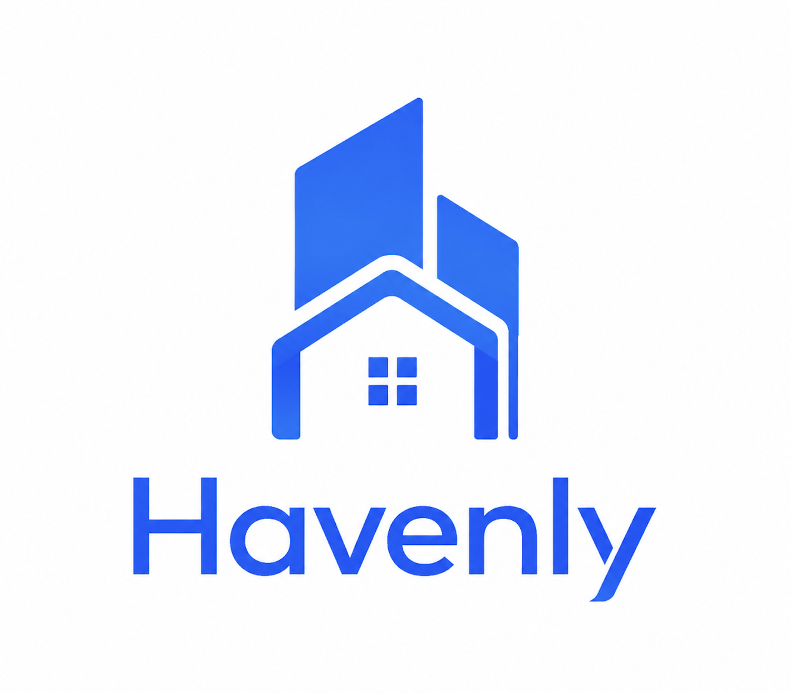
<h1>🏡 Application Mobile Full-Stack de gestion immobilière</h1>
<p>
    <strong>Havenly</strong> est une application immobilière complète conçue pour gérer et explorer des annonces de propriétés sur <strong>iOS</strong> et <strong>Android</strong>.
    Développée avec <strong>Expo (React Native)</strong> et <strong>TypeScript</strong>, elle utilise <strong>NativeWind (Tailwind CSS)</strong> pour une interface moderne et responsive, <strong>Clerk</strong> pour une authentification sécurisée et <strong>Supabase (PostgreSQL)</strong> comme backend robuste.
    L'application permet de <strong>publier des annonces immobilières</strong>, de <strong>rechercher et filtrer des propriétés</strong> selon des critères précis (prix, localisation, type de bien, etc.), de <strong>consulter les détails des biens</strong>, de <strong>contacter les propriétaires</strong> et offre une <strong>interface d'administration</strong> dédiée à la gestion des utilisateurs, des annonces et du contenu de la plateforme.
</p>
</div>

---

## 📸 Screenshots

<div style="display: flex; justify-content: space-between; gap: 10px; flex-wrap: wrap;">

  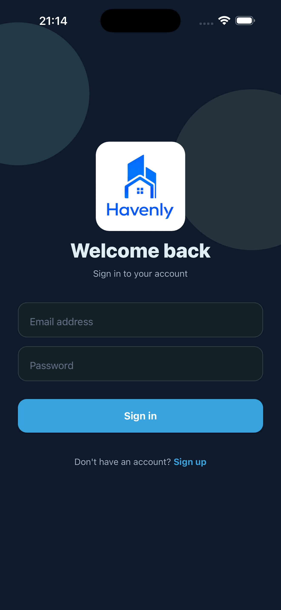
  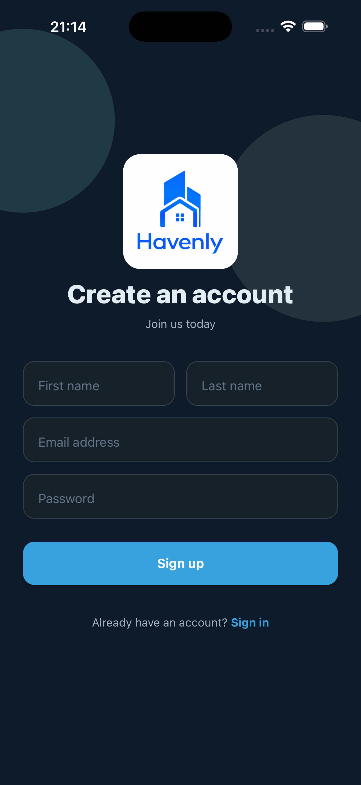
  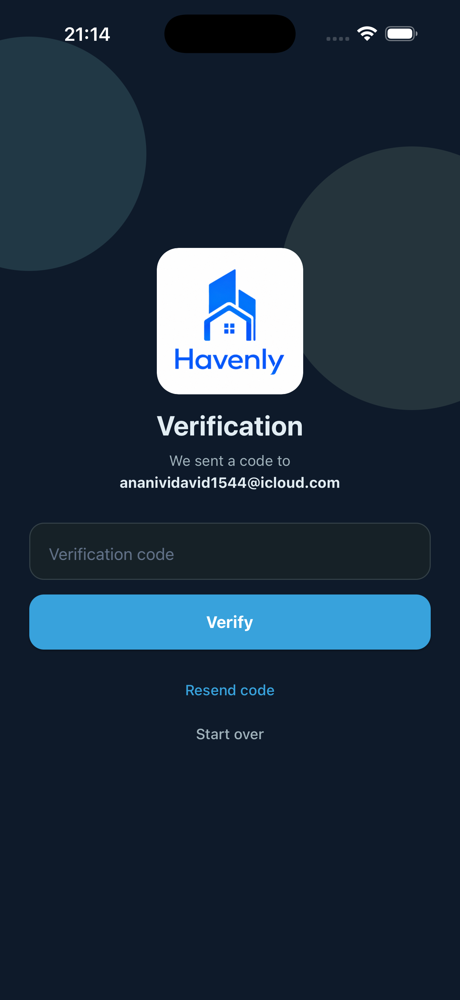

  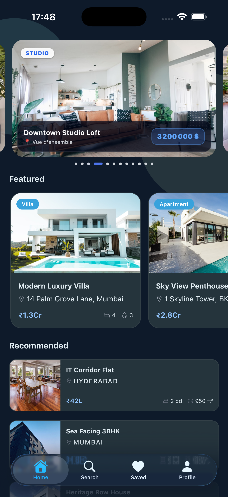
  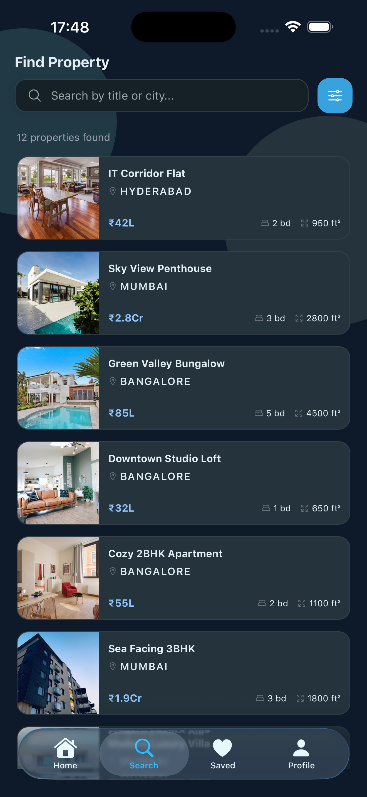
  

  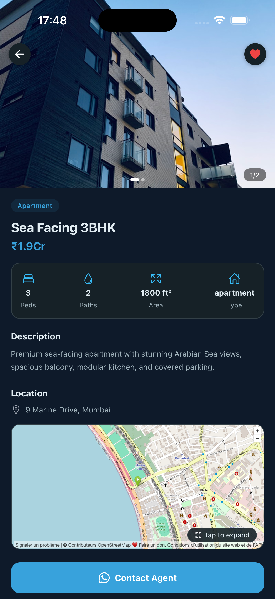
  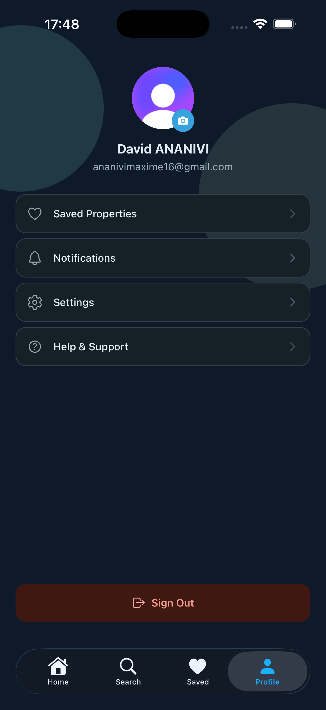
  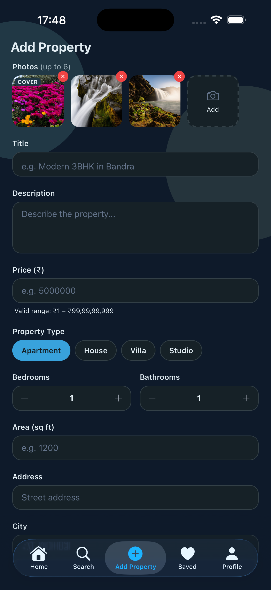
</div>

---

✨ **Points forts :**

- 📱 Application immobilière complète (Full-Stack) pour iOS et Android
- 🧑‍💻 Architecture moderne utilisant React Native, Expo et TypeScript
- 🔐 Authentification utilisateur complète avec Clerk (inscription par email, OTP et support MFA)
- 🏠 Interface d'accueil personnalisée avec flux de propriétés recommandées et en vedette
- 🔍 Système de recherche et filtrage puissant par type, chambres et prix
- 🗺️ Page de détail des propriétés avec carrousel d'images, caractéristiques et carte interactive
- 📞 Bouton de contact avec l'agent via des liens profonds (Deep Links) vers WhatsApp
- 🛡️ Panneau d'administration sécurisé pour la création et la gestion des annonces
- 📸 Gestion des images avec téléchargement multiple et détection automatique des coordonnées
- 🎨 Interface utilisateur moderne conçue avec NativeWind (Tailwind CSS)
- 💎 Navigation iOS avec effet "Liquid Glass" grâce à Expo Native Tabs
- 🗄️ Base de données PostgreSQL gérée avec Supabase
- ⚡ Gestion performante de l'état global avec Zustand
- 💾 Stockage persistant des données utilisateur et des annonces
- 🚀 Déploiement vers le Google Play Store et l'App Store
- 🌙 Design à thème sombre

---

## 🏗 Technology Stack

- **Frontend:** React Native, Expo, TypeScript, NativeWind (Tailwind CSS), Expo Router.
- **Backend & Database:** Supabase (PostgreSQL), Clerk (Authentication).
- **State Management:** Zustand.

---

## 🧱 Architecture simplifiée du Projet

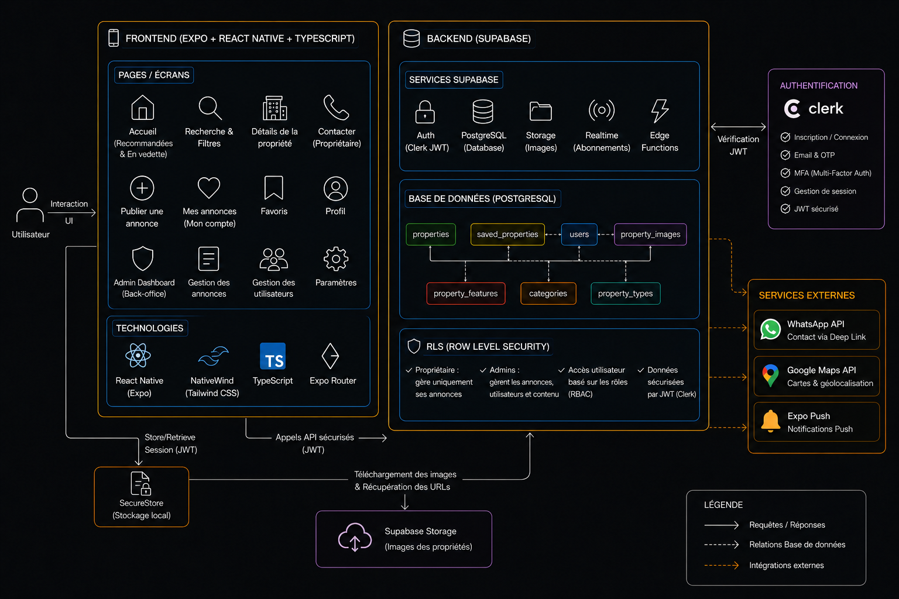

---

## 🗺️ Diagramme Entité–Relation (ERD)

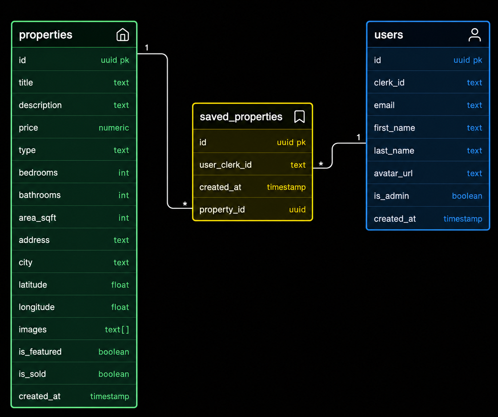

---

## 🌐 Architecture générale de l'application Havenly

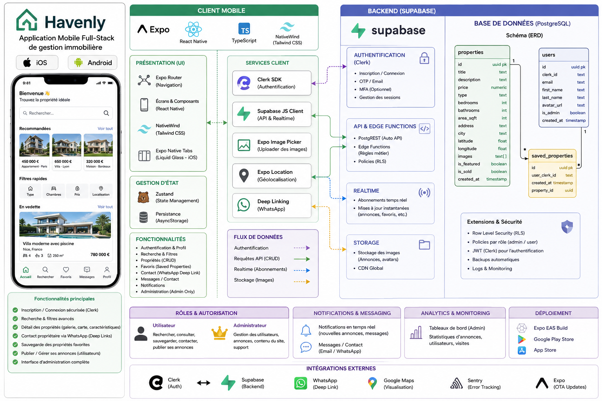

---

## 🔐 Sécurité & Autorisation

- Authentification gérée par Clerk avec JWT automatiquement utilisé pour sécuriser les requêtes Supabase.
- Routes protégées via l’état de connexion (`isSignedIn`) pour restreindre l’accès aux utilisateurs authentifiés.
- Système de rôles (RBAC) via Zustand pour limiter certaines actions aux administrateurs uniquement.
- Actions sensibles confirmées via des modales natives pour éviter les suppressions ou modifications accidentelles.

---

# 🧪 Configuration du fichier `.env`

Créez un fichier `.env` à la **racine du projet** et ajoutez les variables suivantes :

```bash
# =========================
# 🔐 Clerk (Authentification)
# =========================
EXPO_PUBLIC_CLERK_PUBLISHABLE_KEY=your_clerk_publishable_key_here

# =========================
# 🗄️ Supabase (Backend + Database)
# =========================
EXPO_PUBLIC_SUPABASE_URL=your_supabase_project_url_here
EXPO_PUBLIC_SUPABASE_ANON_KEY=your_supabase_anon_key_here
```

## 🔧 Lancer l'application

- Installer les dépendances

  ```bash
  npm install
  ```

- Lancer l’application

  ```bash
  npx expo start -c
  ```
